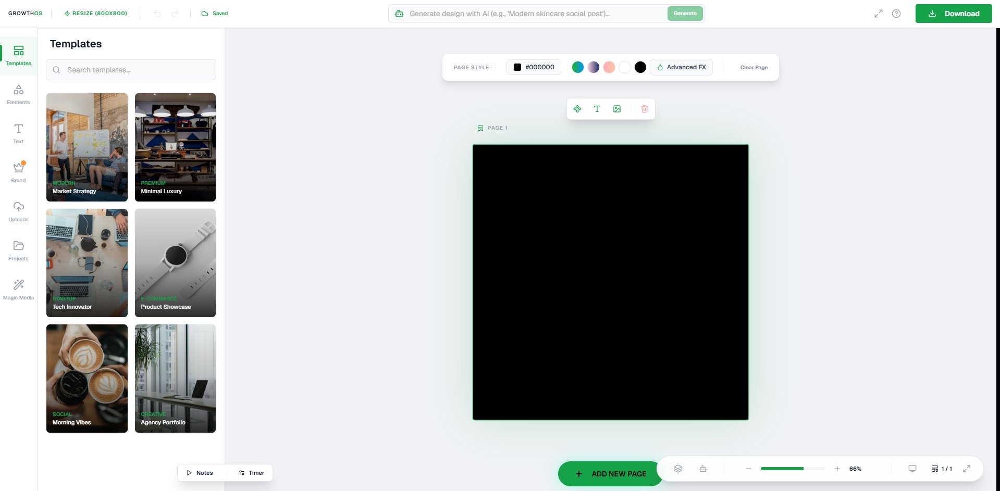

# Pixo 🎨

Pixo is a high-performance **open-source creative design studio** built for the next generation of AI-driven design. 

While tools like Canva dominate the space, they remain closed ecosystems. Pixo was born from the need for an open-source alternative that doesn't just "generate pixels" with diffusion models, but actually **understands and manipulates design tools** through AI tool-calling.



## 🧠 The Vision: AI Tool-Calling vs. Diffusion

Most AI design tools today use Diffusion models to generate static images. This is great for art, but terrible for design flexibility. 

**Pixo's goal is different:** We want to enable AI to:
1.  **Call Tools**: Directly interact with the Fabric.js canvas, layers, and properties.
2.  **Strategic Design**: Use Genkit and Gemini to strategically place elements, choose layouts, and adjust typography based on design principles.
3.  **Full Editability**: Since the AI manipulates the code/canvas directly, every design remains 100% editable by the user.

## ✨ Current State

The **Frontend is mostly complete**. We have a polished, cinematic UI and a robust canvas engine ready for action. 

**What we need now is "Mad & Intense functionality":**
- Implementing complex tool-calling protocols.
- Deep integration between Genkit and the Fabric.js engine.
- Advanced layout algorithms that the AI can trigger.

## 🚀 Getting Started

### 1. Prerequisites
- Node.js (Latest LTS)
- A Firebase Project
- A Google AI (Gemini) API Key

### 2. Installation
```bash
git clone https://github.com/I-m-a-m-4/pixo.git
cd pixo
npm install
```

### 3. Environment Setup
Fill in your Firebase credentials and AI API keys in `.env` (use `.env.example` as a template).

### 4. Run Development Server
```bash
npm run dev
```

## 🛠️ Tech Stack
- **Framework**: Next.js 15
- **Canvas Engine**: Fabric.js
- **AI Orchestration**: Google Genkit
- **Database/Auth**: Firebase
- **Styling**: Tailwind CSS / Framer Motion

## 📄 License
This project is licensed under the MIT License - making Pixo free and open for the community forever.
